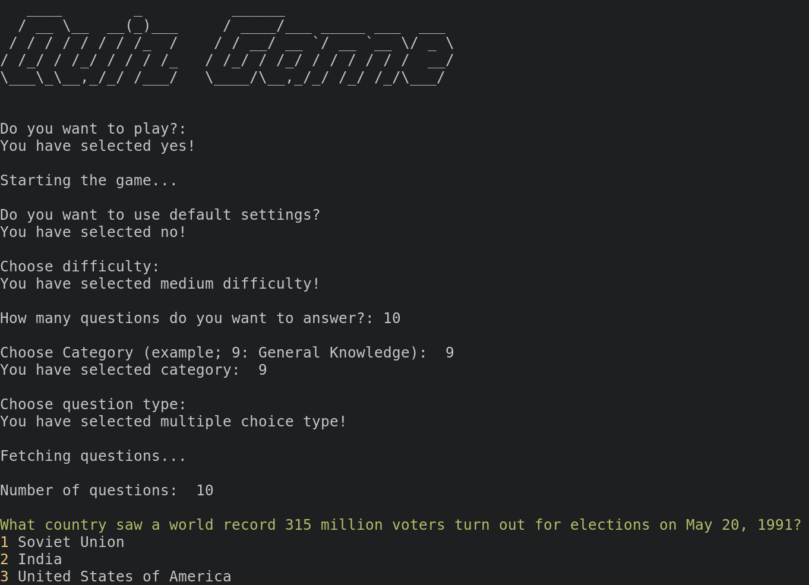

# Quiz Game

A quiz game that uses the Open Trivia Database (OpenTDB) API to fetch questions for the game.



## Getting Started

### Prerequisites

* Python 3.x
* `requests` library
* `json` library
* `os` library
* `colored` library
* `pyfiglet` library
* `simple_term_menu` library

### Installation

* Clone the repository:

```bash
git clone 
```

* Install the required libraries:

```bash
pip install -r requirements.txt
```

## Usage

* Run the script:

```bash
python quiz_game.py
```

* Choose whether to use the default settings or customize your own settings.
* Select the difficulty, number of questions, and category of the quiz.
* Answer the questions and select your answer from a list of options.
* The script will check if your answer is correct and keep track of the number of correct answers.
* The game ends when all questions have been answered and the script displays the number of correct answers.

## Examples

You can customize the game to your liking by changing the settings, for example:

* Easy difficulty, 5 questions, Sports category
* Medium difficulty, 10 questions, Entertainment: Music category
* Hard difficulty, 20 questions, Science: Computers category

## Contribution

We welcome contributions to this project. If you want to contribute, please follow these guidelines:

* Create a fork of the repository
* Create a new branch with a descriptive name
* Make your changes and test them thoroughly
* Create a pull request

## Acknowledgments

* Open Trivia Database (OpenTDB) API for providing the questions
* `requests`, `json`, `os`, `colored`, `pyfiglet` and `simple_term_menu` libraries for making the development easier.
