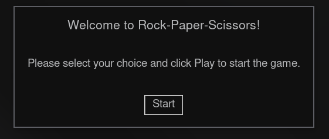
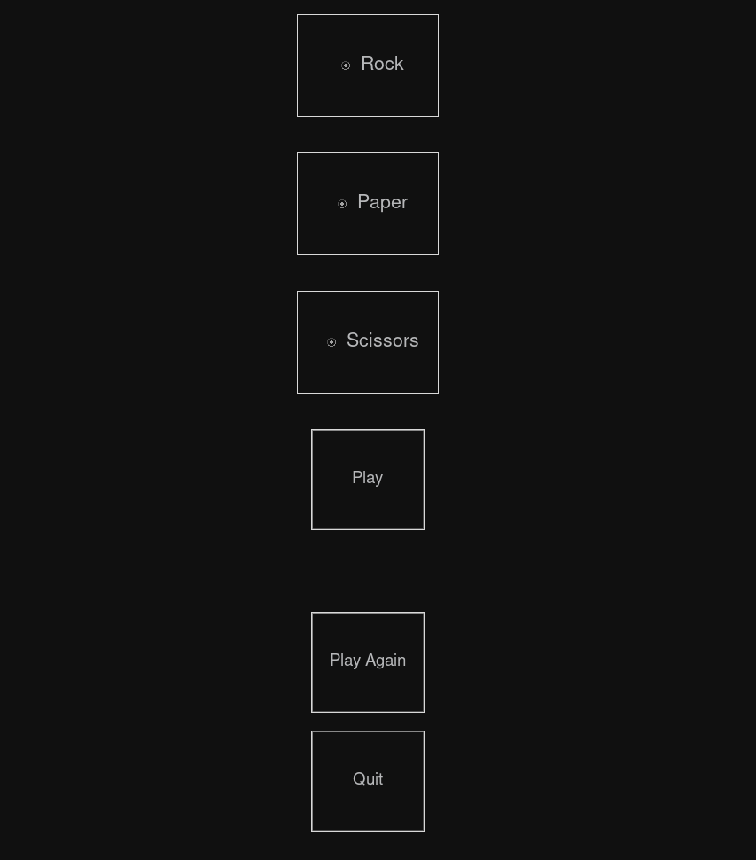

# Rock-Paper-Scissors Game

A simple Rock-Paper-Scissors game built using Python and Tkinter.

### Welcome Screen



### Game Screen



## How to Play

1. Run the code to start the game.

   ```bash
   pip install -r requirements.txt
   python rock_paper_scissors.py
   ```
2. A welcome screen will appear, click on "Start" to begin the game.
3. Choose either rock, paper, or scissors by clicking on the corresponding button.
4. Click on "Play" to submit your choice and reveal the computer's choice.
5. A message will appear displaying the outcome of the game (win, lose, or tie).
6. Click on "Play Again" to play again or "Quit" to exit the game.

## Requirements

* Python 3.11
* Tkinter library

## Code Structure

The code is structured as follows:

* The `play_game` function handles the logic for determining the outcome of the game based on the user's and computer's choices.
* The `play_again` function clears the result label and allows the user to play again.
* The `quit_game` function closes the game window.
* The `start_screen` function creates the welcome screen that appears when the game is first launched.
* The main body of the code sets up the game window, including the radio buttons for the user to select their choice, labels to display the result and computer's choice, and buttons to play again and quit the game.

Note:

* The `start_window.destroy()` method is used to close the welcome screen after the user clicks the start button.
* The `root.withdraw()` method is used to initially hide the main game window until the user clicks the start button.
* The `root.deiconify()` method is used to reveal the main game window.
