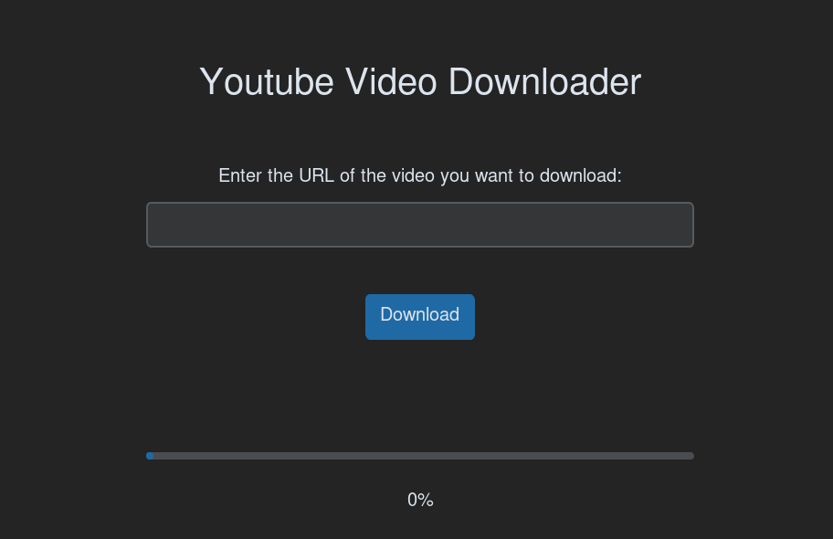
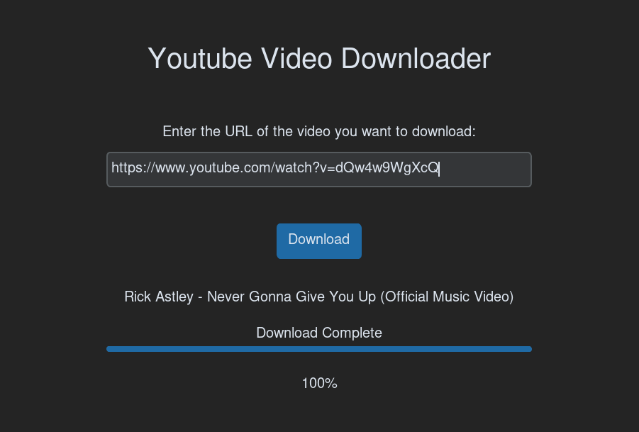

# Youtube Video Downloader

A simple Python application that allows users to download videos from YouTube by inputting the video's URL.



## Prerequisites

* Python 3.11
* Tkinter
* Pytube
* customtkinter (A tkinter wrapper library)

## Installing

1. Clone the repository or download the zip file
2. Install the required libraries using pip:

```bash
pip install -r requirements.txt
```

## Usage

1. Run the script using python:

   ```bash
   python main.py
   ```
2. A window will appear where you can input the URL of the video you want to download
3. Click the "Download" button to begin the download
4. A progress bar and percentage label will appear to show the progress of the download
5. Once the download is complete, a message will appear on the screen

   

## Note

This application is for educational purposes only and it is the responsibility of the user to ensure that they are not infringing on copyright laws by downloading videos from YouTube.
